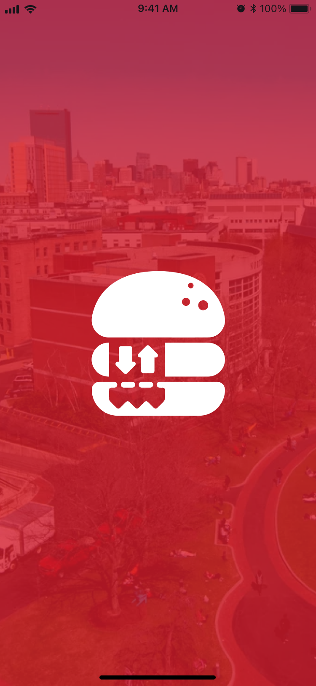
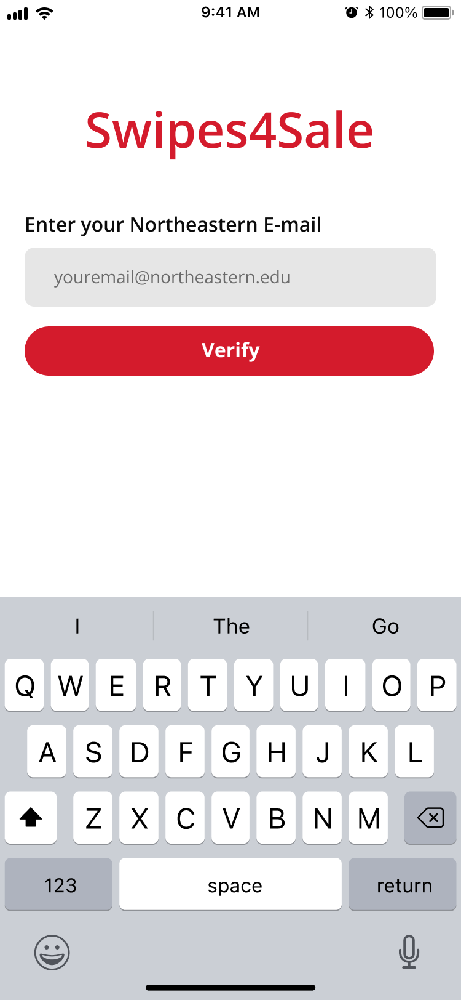
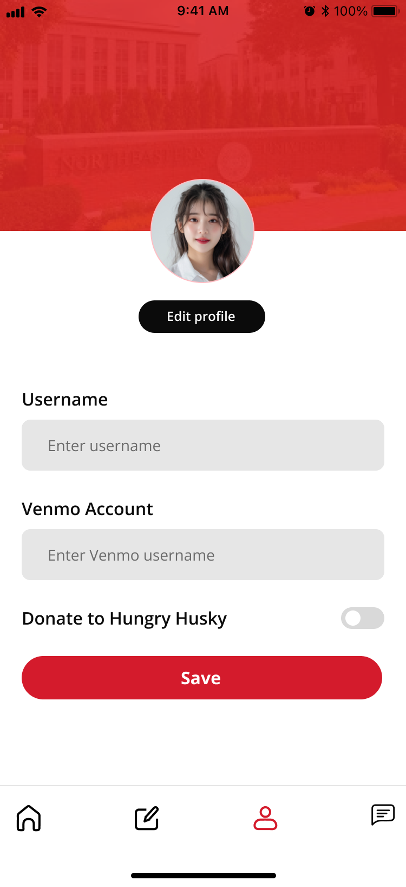
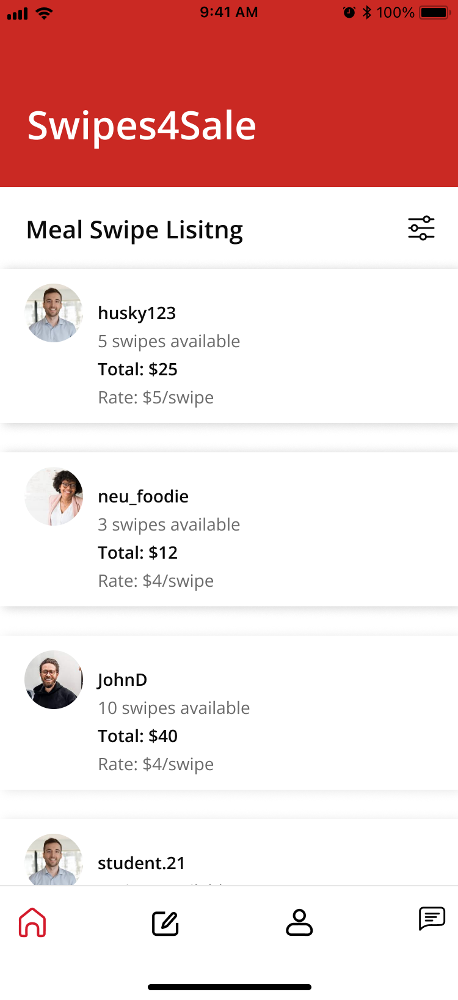
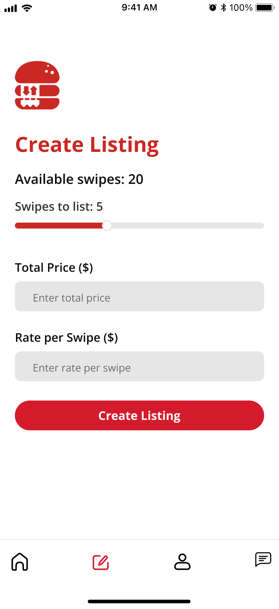
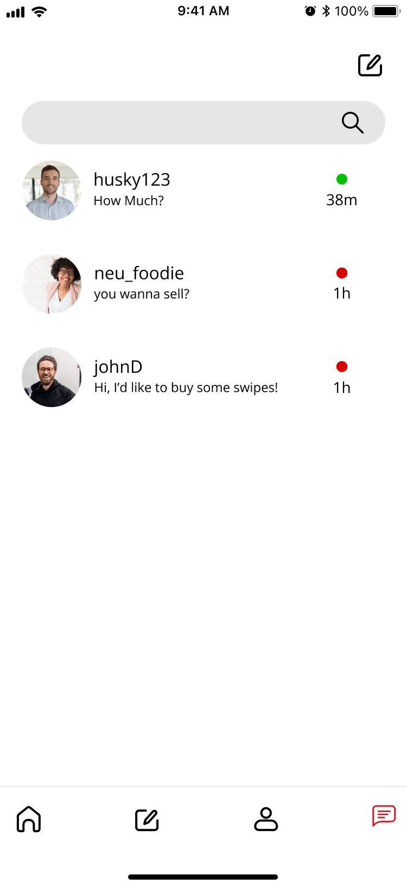
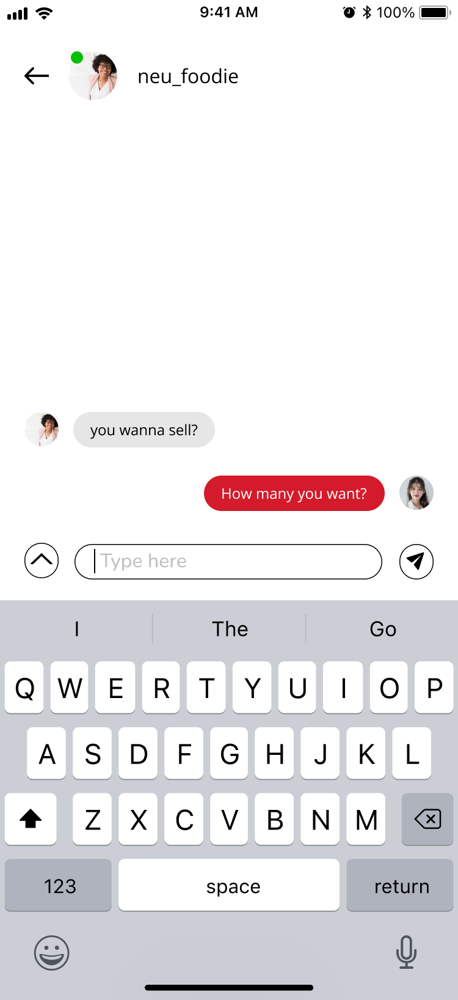

# Swipes4Sale

> A cross-platform iOS and Android marketplace for student-to-student meal swipe exchange at Northeastern University.

*This repo serves as a preview of the full application. The complete codebase is kept private for security reasons.*

---

## Tech Stack

| Layer | Technology |
|---|---|
| Frontend | React Native, TypeScript |
| Backend | Java, GraphQL |
| Database | AWS DynamoDB |
| Infrastructure | AWS (EC2, S3, CloudFront) |

---

## Background

During my freshman year at Northeastern, I noticed that my friends and I consistently had leftover meal swipes expiring every Sunday — each worth $25 at the dining hall. The university's donation program, Hungry Husky, capped donations at 3 swipes per week with no automation, making it easy to forget and let swipes go to waste.

I initially explored building a script to auto-donate the maximum 3 swipes weekly, but quickly realized that wasn't enough. After reaching out to the Hungry Husky organizers about raising the cap and getting nowhere, I decided to build something that could connect students directly — those with extra swipes and those who needed them.

**Swipes4Sale** lets students list meal swipes at prices well below dining hall rates — or for free. It also includes built-in automated weekly donations to Hungry Husky for students who prefer that route.

Before writing a line of code, I surveyed 155 students across all grade levels at Northeastern. **93% said they would use the app upon release.**

---

## Key Technical Decisions

### React Native over native iOS/Android
To maximize reach, I needed both iOS and Android support. React Native allowed me to ship a single TypeScript codebase to both platforms without sacrificing the native feel that a marketplace app requires.

### GraphQL over REST
I chose GraphQL to query AWS DynamoDB because the app's screens frequently need data from multiple resources simultaneously — listings, user profiles, and messaging threads. REST would have required multiple sequential round trips (waterfall requests) and risked over-fetching. GraphQL let me request exactly what each screen needed in a single query, keeping the app performant and the backend scalable.

---

## Features

- 📋 Create and delete meal swipe listings
- 👤 Customizable user profiles with Venmo linking
- 💬 Private messaging between buyers and sellers
- 🎓 Student verification via university email domain
- 🤝 Automated weekly Hungry Husky donation integration

---

## Validation

| Metric | Result |
|---|---|
| Students surveyed | 155 |
| Grade levels represented | Freshman – Senior |
| Would use upon release | 93% |

---

## App Preview

### Onboarding

### Student Verification

### Profile Setup

### Meal Swipe Listings

### Create a Listing

### Messages

### Direct Message

