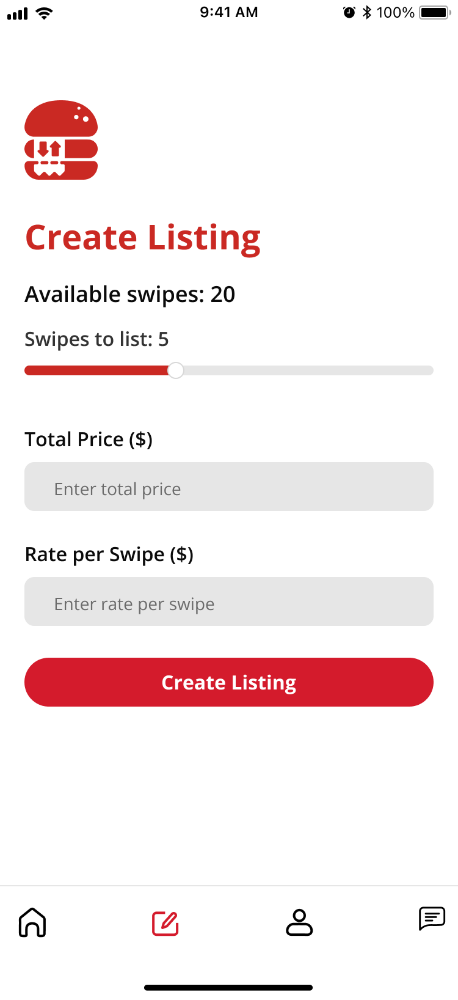

# Swipes4SalePreview
This repo serves a preview of my full stack app for student to student meal swipe exchange at Northeastern Unviersity. I've decided to keep my code private for security reasons as it is an actively published app. 

The following technologies were leverged in the creation of this app:
- React Native
- TypeScript
- Java
- AWS (Dynamo DB)
- GraphQL

## What Inspired Me?
I first thought of developing this app during my freshman year at Northeastern University because my friends and I always had left over meal swipes by the end of the week. There was a program called Hungry Husky where you could donate meal swipes each week but they only allowed a maximum of 3 to be donated. On Sunday each week, any leftover meal swipes expire and they're now worthless. You also couldn't set your account to automatically donate to Hungry Husky either so I found even myself forgetting to do so at times and letting these meal swipes go to waste instead of helping others. Meal swipes purchased at the dining halls are $25/meal which felt wrong to charge when so many meal swipes are going unused.

## How it Started?
Originally, I wanted to develop a script to automatically approve 3 of my meal swipes to donate to Hungry Husky every week and make the script public to allow others to use it and do the same. Although, I realized many weeks I have more than 3 swipes left over and so did my friends. I thought how could I go about giving more than 3 swipes since upon emailing the Hungry Husky program organizers they didn't seem like they'd budge on increasing the maximum donatable amount. I knew I had to go directly to people who were in need of meal swipes which is what led me to the idea of developing an app to reach more poeple in need and people who wanted to help. This started the creation of Swipes4Sale which allows users to list meal swipes for sale at a significantly cheaper price than dining halls charge and many people even list them for free! There is also an option to set up automatic donations every week to the Hungry Husky program within the app. Next while planning out my project, I surveyed students at Northeastern University via an acceptance test. I asked students of varying grade levels if they would use the app upon release and 93% said they would out of 155 students!

## Developing the App
I wanted to reach as many people as possible so I thought a cross platform, iOS and Android, app would be the best approach. This is where I learned about React Native and it felt like the most time efficient solution for me to get the app running as soon as possible while also learning a useful and powerful tool. Next I needed to decide which features my app would support which I decided on the following: 
Creating and Deleting posts, Customizable User Profiles, Messaging, Venmo Linking, automated Hungry Husky Donations, and Student Verifiation. From here, I thoguht of how I would support the backend of my app which I wanted to leverage something new as an opportunity to learn. I recently recieved my AWS Cloud Practioner ceritfication so I planned to use AWS DynamoDB. Then I looked into GraphQL instead of REST because it had attractive features that made it better fit for my app. With GraphQL, I was able to query my AWS DynamoDB service in order to dynamically request multiple resources in each query without over-fetching and to reduce waterfall requests, thus allowing scalability. 

## Preview of the App
Below are some images from different screens of my app showcasing how it looks and functions!

### Loading Screen

### Student Verification

### Customizing your Profile

### Current Meal Swipe Listings

### Creating Your Own Meal Swipe Listing

### Private Messages Screen

### Within a Direct message

